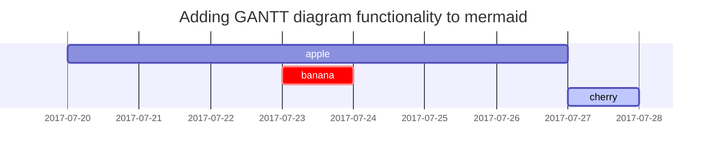

This page is a playground to test out various coding ideas.

## Interactive D3 Tree Diagram

The javascript library [D3](https://d3js.org/) can be used to make some incredibly flexible and high performance visualizations. Here's a little test of a collapsable tree-view. The code is based on [this example](https://observablehq.com/@d3/collapsible-tree).




## Markdown Features

Testing of various markdown text & formatting features within the website.

### Checked list

- [ ] Job
  - [x] Step 1
  - [x] Step 2
  - [ ] Step 3

### Tables

| Company                      | Contact          | Country |
| :--------------------------- | :--------------- | ------: |
| Alfreds Futterkiste          | Maria Anders     | Germany |
| Island Trading               | Helen Bennett    |      UK |
| Magazzini Alimentari Riuniti | Giovanni Rovelli |   Italy |

### Code

This is an example of `Inline Code`, followed by a code block:

```sass
@import
  "colors/light-typography",
  "colors/dark-typography";
```

### Mathematics

The mathematics powered by [**MathJax**](https://www.mathjax.org/):

$$
\begin{equation}
  \sum_{n=1}^\infty 1/n^2 = \frac{\pi^2}{6}
  \label{eq:series}
\end{equation}
$$

When $a \ne 0$, there are two solutions to $ax^2 + bx + c = 0$ and they are

$$ x = {-b \pm \sqrt{b^2-4ac} \over 2a} $$

### Mermaid SVG




### Youtube Video




